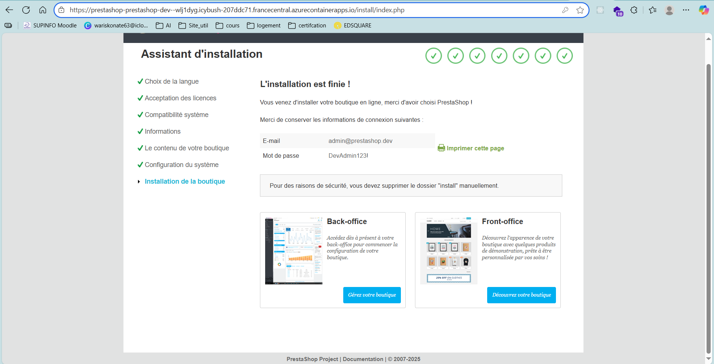

# Taylor Shift's Ticket Shop - Infrastructure

> Infrastructure scalable pour la vente de billets de concert utilisant HCL, AWS et DockerHub

## 🎯 Vue d'Ensemble

Ce projet déploie une infrastructure hautement scalable capable de gérer des pics de trafic massifs lors de la vente de billets de concert. L'architecture utilise Amazon cloud avec auto-scaling automatique et une approche multi-environnements (developpement/production).

### 🎯 Conçu dans un cadre pédagogique pour démontrer :

- ✅ Infrastructure as Code avec Terraform
- ✅ Architecture cloud moderne sur Azure
- ✅ Déploiement de containers avec Azure Container Apps
- ✅ Gestion de bases de données managées
- ✅ Sécurité et bonnes pratiques DevOps

### Architecture Technique

- **Infrastructure as Code** : Terraform HCL
- **Container Orchestration** : Azure et dockerHub
- **Application** : PrestaShop (e-commerce)
- **Base de données** : azure mySql database
- **Auto-scaling** : Load Balancing, Internet gateway et auto-scaling

## ☁️ Architecture Azure

Ce projet déployant une infrastructure cloud basée sur différents services Azure. Voici les composants principaux :

| Composant Azure                   | Description                                                                                                         |
| --------------------------------- | ------------------------------------------------------------------------------------------------------------------- |
| **Azure Resource Group**          | Conteneur logique regroupant toutes les ressources Azure liées à l’environnement.                                   |
| **Azure Virtual Network (VNet)**  | Réseau privé dans Azure permettant la communication sécurisée entre les services.                                   |
| **Subnets**                       | Segments logiques du VNet, isolant les ressources (ex. bases de données, apps).                                     |
| **Azure Container Apps**          | Service PaaS pour exécuter des microservices ou applications conteneurisées sans gérer l’infrastructure.            |
| **Azure Container Instances**     | Déploie des conteneurs de manière isolée, ici utilisé pour héberger l’application PrestaShop.                       |
| **Azure Database for MySQL**      | Base de données relationnelle managée utilisée pour stocker les données de PrestaShop.                              |
| **Azure Storage Account**         | Fournit un stockage persistant (Blob, fichiers, etc.), utilisé par l’application pour sauvegarder fichiers ou logs. |
| **Azure Log Analytics Workspace** | Centralise les logs et métriques des ressources pour la supervision et le diagnostic.                               |

## 🧱 Architecture visuelle

## Architectural Diagram

```bash
┌─────────────────────────────────────────────────────────────┐
│                    Azure Subscription                       │
│  ┌───────────────────────────────────────────────────────┐  │
│  │              Resource Group: prestashop-{env}-rg      │  │
│  │                                                       │  │
│  │  ┌──────────────┐         ┌──────────────────────┐    │  │
│  │  │   VNet       │───────▶│  Container App Env   │   │  │
│  │  │ 10.0.0.0/16  │         │  + Log Analytics     │   │  │
│  │  └──────────────┘         └──────────┬───────────┘   │  │
│  │         │                            │               │  │
│  │         │                              ▼             │  │
│  │  ┌──────▼──────────┐         ┌──────────────────┐    │  │
│  │  │   Subnets       │         │  Container App   │    │  │
│  │  │  - Public       │         │   PrestaShop     │    │  │
│  │  │  - Private      │         │  (Auto-scaling)  │    │  │
│  │  └─────────────────┘         └────────┬─────────┘    │  │
│  │                                       │              │  │
│  │  ┌──────────────────┐                 │              │  │
│  │  │  MySQL Flexible  │◀───────────────┘              │  │
│  │  │     Server       │                                │  │
│  │  │  (Private subnet)│                                │  │
│  │  └──────────────────┘                                │  │
│  │                                                      │  │
│  │  ┌──────────────────┐                                │  │
│  │  │ Storage Account  │                                │  │
│  │  │  - Azure Files   │                                │  │
│  │  │  (Persistent)    │                                │  │
│  │  └──────────────────┘                                │  │
│  └───────────────────────────────────────────────────────┘  │
└─────────────────────────────────────────────────────────────┘

      Internet ────▶ Container Apps Ingress (HTTPS) ────▶ PrestaShop
```

### ✨ Fonctionnalités

Infrastructure

- 🏗️ Multi-environnements : Dev, Production isolés
- 🔄 Auto-scaling : Adaptation automatique à la charge
- 🔒 Sécurité renforcée : Secrets managés, HTTPS, isolation réseau
- 📊 Monitoring : Logs centralisés, métriques de performance
- 💾 Haute disponibilité : Réplication, sauvegardes automatiques
- 🚀 CI/CD ready : Intégration GitHub Actions (en cours)

---

### E-commerce PrestaShop

- 🛒 Vente de billets : Gestion de concerts et événements
- 💳 Paiements sécurisés : Intégration modules de paiement
- 📱 Responsive : Compatible mobile, tablette, desktop
- 🌍 Multi-langues : Français par défaut, extensible
- 📧 Notifications : Emails automatiques pour commandes

## Deployment Steps

## 📋 Prérequis

Note : Ce projet a été développé et testé sur Windows 10/11. Les commandes sont optimisées pour PowerShell ou CMD Windows.
NB: il se pourrait que le terminal de votre IDE vous mette des erreurs il serait mieux de passer par le terminal windows directement

---

### Versions Requises

| Outil    | Version Minimum | Version Recommandée |
| -------- | --------------- | ------------------- |
| Node.js  | 20.0.0          | 20.x.x (LTS)        |
| npm      | 9.0.0           | Latest              |
| AzureCLI | 3.0             | Latest              |

### 🔑 Compte Azure

- ✅ Compte Azure actif
- ✅ Droits Contributor minimum sur la subscription
- ✅ Région recommandée : France Central (latence optimale)
- ✅ Quota suffisant pour les ressources (vérifier les limites)

### 1. Configuration Azure CL

```bash
# Connexion à Azure
az login

# Vérifier la subscription active
az account show

# Si nécessaire, changer de subscription
az account set --subscription "VOTRE-SUBSCRIPTION-ID"

# Enregistrer le provider Container Apps (IMPORTANT): car nous avons utilisé qui sont pas souvent par défaut
az provider register --namespace Microsoft.App
az provider register --namespace Microsoft.ContainerService

# Vérifier l'enregistrement (attendre "Registered")
az provider show --namespace Microsoft.App --query "registrationState"
```

### 2. Cloner le repository

```bash
# Cloner le projet
git clone https://github.com/abdoulWaris/azure_prestashop.git
cd azure_prestashop
```

## Organisation du code

```bash
azure_prestashop/
├── 📄 README.md                       # Documentation principale
├── 📂 docs/                           # Documentation détaillée
│   ├── architecture.md
│   ├── troubleshooting.md
│   └── prestashop.png
│
├── 📂 modules/                        # Modules Terraform réutilisables
│   ├── resource_group/                # Groupe de ressources
│   ├── networking/                    # VNet, Subnets, NSG
│   ├── container_app_environment/     # Environnement Container Apps
│   ├── container_app/                 # Container PrestaShop
│   ├── database/                      # MySQL Flexible Server
│   ├── storage/                       # Azure Files
│   └── log_analytics/                 # Monitoring
│
├── 📂 environments/                   # Configurations par environnement
│   ├── dev/
│   │   ├── main.tf
│   │   ├── variables.tf
│   │   ├── outputs.tf
│   │   └── terraform.tfvars.example
│   ├── Production/
│   └── main.tf
│       ├── variables.tf
│       ├── outputs.tf
│       └── terraform.tfvars.example
│
│
├── 📂 scripts/                        # Scripts d'automatisation
│   ├── deploy-dev.sh
│   ├── deploy-prod.sh
│   ├── cleanup.sh
│   └── post-install.sh
│
└── 📂 .github/workflows/              # CI/CD (en cours)
    └── deploy.yml
```

### 3. 🔐 Configuration des variables

En fonction de l'environnement que vous voulez deployer
(dev/prod), créer un fichier nommé terraform.tfvars dans lequel vous devriez definir les variables principales:

### 🔑 Variables principales

- **project_name** : nom logique du projet, utilisé comme préfixe pour nommer les ressources Azure.
- **location** : région Azure où les ressources sont déployées.
- **mysql_user_username** : nom d’utilisateur administrateur du serveur MySQL.
- **mysql_user_password** : mot de passe administrateur MySQL (**sensible**).
- **admin_email** : adresse e-mail de l’administrateur PrestaShop (accès back-office).
- **admin_password** : mot de passe administrateur PrestaShop (**sensible**).

**IMPORTANT** : Utilisez des mots de passe forts respectant :

- ✅ Minimum 12 caractères
- ✅ Majuscules, minuscules, chiffres, caractères spéciaux
- ✅ Pas de mots du dictionnaire
- ✅ Différents pour chaque environnement

### 4. 🚀 Déploiement

Rendez vous dans le dossier de l'environnement que vous avez choisi de laner, et lancez les commandes suivantes:

> **Conseil** : Utilise toujours terraform plan avant terraform apply pour prévisualiser les changements et si vous apportez des modification faites terraform validate

### 📝 Étapes détaillées

1️⃣ Se placer dans l'environnement

```bash
# Environnement de développement
cd environments/dev

# OU environnement de production
cd environments/prod
```
2️⃣ Initialiser Terraform
```bash
# Télécharger les providers et modules
terraform init

# Sortie attendue:
# Terraform has been successfully initialized!
-------
# Télécharger les providers et modules
terraform init

# Sortie attendue:
# Terraform has been successfully initialized!
-------
# Vérifier la syntaxe HCL seulement si vous avez apporté des modifications
terraform validate

# Sortie attendue:
# Success! The configuration is valid.
-------
# Prévisualiser les changements
terraform plan -var-file="terraform.tfvars"

# Analyser attentivement le plan :
# - Ressources à créer (+)
# - Ressources à modifier (~)
# - Ressources à détruire (-)
--------
# Déployer l'infrastructure
terraform apply -var-file="terraform.tfvars"

# Confirmer avec 'yes' quand demandé
# ⏳ Durée: 10-15 minutes

# Ou en mode automatique (pour scripts)
terraform apply -var-file="terraform.tfvars" -auto-approve
```
##📊 Suivi du déploiement
Le déploiement crée les ressources dans cet ordre :

- ✅ Resource Group
- ✅ Virtual Network & Subnets
- ✅ Log Analytics Workspace
- ✅ Storage Account & File Share
- ✅ MySQL Flexible Server
- ✅ Container App Environment
- ✅ Container App PrestaShop
à la fin du deploiment faites un ```terraform output``` et vous aurez
```bash
Outputs:

prestashop_url = "lien du site deployé"
admin_url = "lien du site deployé/admin"
database_server = "url de votre server de base de donnée"
resource_group_name = "le nom du ressource groupe"
terraform output database_fqdn_info
# Ou Pour avoir les valeurs de la Base
terraform output database_fqdn_info # Copier la valeur fqdn
```
### 5. 🔧 Post-installation
PrestaShop nécessite la suppression du dossier /install après l'installation pour des raisons de sécurité.
📄 [Voir l'estimation détaillée](./docs/postInstall.md.md)

### 6. 🔒 Sécurisation post-installation

1. Changer les mots de passe par défaut

```bash
- Accéder à l'interface admin
- Mon compte > Modifier le mot de passe
```
2. Renommer le dossier admin (recommandé)
```bash
# Via Azure Files, renommer admin en admin-xyz123
```
### 6. Destruction de l'infrastructure
Selon l'environnement choisi:
```bash
cd environment/developpement ou production

# Prévisualiser la destruction
terraform plan -destroy -var-file="terraform.tfvars"

# Détruire l'infrastructure
terraform destroy -var-file="terraform.tfvars"

# Confirmer avec 'yes'
# ⚠️ ATTENTION: Cette action est IRRÉVERSIBLE
```
### 7. 🐛 Dépannage
## Erreurs courantes
1. Erreur Provider Microsoft.App
```bash
Error: Provider Microsoft.App is not registered
#Solution
az provider register --namespace Microsoft.App
# Attendre 5-10 minutes
az provider show --namespace Microsoft.App --query "registrationState"
```
2. Quota dépassé

```bash
Error: Quota exceeded for resource type
#Solution
az vm list-usage --location "France Central" --output table
# Ouvrir un ticket support Azure si nécessaire
```

## Resultat

A la fin vous avez votre page prestashop prête

## Estimation
📄 [Voir l'estimation détaillée](./docs/estimation.md)