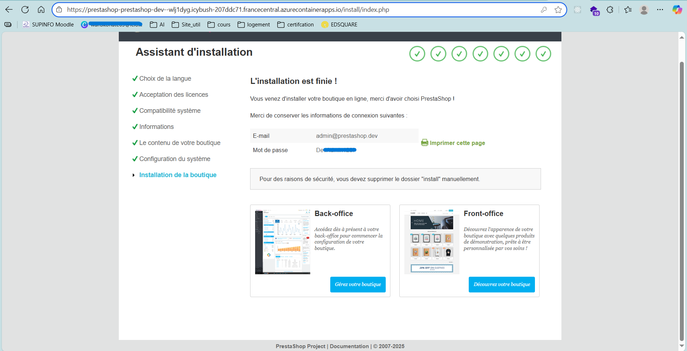

# Taylor Shift's Ticket Shop - Infrastructure

> Infrastructure scalable pour la vente de billets de concert utilisant HCL, AWS et DockerHub

## 🎯 Vue d'Ensemble
Ce projet déploie une infrastructure hautement scalable capable de gérer des pics de trafic massifs lors de la vente de billets de concert. L'architecture utilise Amazon cloud avec auto-scaling automatique et une approche multi-environnements (developpement/production).

### 🎯 Fonctionnalités

- ✅ **Multi-environnements** : Dev, Production  
- ✅ **Infrastructure modulaire** : Modules Terraform réutilisables  
- ✅ **Base de données** : Azure MySQL Flexible Server  
- ✅ **Stockage persistant** : Azure Files  
- ✅ **Sécurité** : Variables d'environnement sécurisées  
- ✅ **CI/CD** : GitHub Actions pour déploiement automatique en cours
- ✅ **Monitoring** : Tags et organisation des ressources  

### Architecture Technique
- **Infrastructure as Code** : Terraform HCL
- **Container Orchestration** : Azure et dockerHub
- **Application** : PrestaShop (e-commerce)
- **Base de données** : azure mySql database 
- **Auto-scaling** : Load Balancing, Internet gateway et auto-scaling

## Architecture Overview
le diagramme initial est réalisé pour Amazon mais se comprends aisement avec Azure
## Architectural Diagram


### Explication
### 1. **VPC Module**
Le module VPC se charge du reséau de l'infrastructure:
- **Sous-réseau public** Pour la partie Web (accessible depuis internet).
- **Sous-réseau privée** Pour la partie application et base de donnée (isolée).
- 2 Sous-réseaux publics (10.0.0.0/24 et 10.0.1.0/24) pour la passerelle NAT et l'ALB.
- 4 Sous-réseaux privés dont 2 pour l'application (10.0.2.0/24, 10.0.3.0/24) et 2 pou la base de données (10.0.4.0/24, 10.0.5.0/24).
- Inclus la passerelle NAT pour l'accès Internet sortant depuis des sous-réseaux privés.

### 2. **Web Tier**
- EC2 instances pour l'hébergement de application.
- Elastic Load Balancer (ELB) pour distribuer le traffic à travers multiples instances.

### 3. **Application Tier**
- Auto Scaling Groups (ASG) pour manager les serveurs.
- Établit des instances en fonction de la charge pour assurer une haute disponibilité.

### 4. **Database Tier**
- Amazon RDS pour la gestion des bases de données relationnelles.
- Configuré pour une haute disponibilité et une récupération après sinistre avec Multi-AZ.

### Autres 
- Amazon ECR (Registry de Conteneurs Élastique) : Pour stocker des images Docker.
- Amazon ECS (Service de Conteneurs Élastiques) : Pour exécuter des conteneurs Docker.
- Amazon S3 : Pour stocker les fichiers d'environnement. 
- Amazon DynamoDB : Pour verrouiller l'état de Terraform.
- Rôles IAM : Pour garantir un accès sécurisé aux services.
---
## Deployment Steps

## 📋 Prérequis
Pour ce projet nous avons travaillé sur une distribution windows 10 ainsi toute les étapes si dessous mentionnées prennent en compte l'environnement.
NB: il se pourrait que le terminal de votre IDE vous mette des erreurs il serait mieux de passer pour le terminal windows directement
### Versions Requises
| Outil | Version Minimum | Version Recommandée |
|-------|----------------|-------------------|
| Node.js | 20.0.0 | 20.x.x (LTS) |
| npm | 9.0.0 | Latest |
| AzureCLI | 3.0 | Latest |

### Compte AWS
- **Compte Azure actif** avec un accès IAM configuré || droits administrateur 
- **Azure CLI configuré** avec credentials
- **Région Azure** : `france central` (recommandée pour la France)
```bash
# Vérifier Terraform
terraform --version

# Vérifier Azure CLI
az --version

# Configuration
az login

# Vérifier la connexion Azure
az account show
```
## Organisation du code
azure_prestashop/
├── docs/                         # Documentation
├── environments/                 # Configuration par environnement
│   ├── dev/                      # Développement
│   ├── prod/                     # Production
│   └── staging/                  # Test
│
├── modules/                      # Modules Terraform réutilisables
│   ├── container_app_environment/ # Environnement Container Apps
│   ├── container_instance/        # Container PrestaShop
│   ├── database/                  # Base de données MySQL
│   ├── log_analytics/             # Workspace Log Analytics
│   ├── networking/                # Réseau (VNet, Subnets, etc.)
│   ├── resource_group/            # Groupe de ressources Azure
│   └── storage/                   # Stockage persistant
│
├── scripts/                       # Scripts de déploiement
└── README.md                      # Documentation principale


### 2. Clone the Repository
Download the Terraform configuration files:
```bash
git clone <repository-url>
cd <repository-folder>
```
### 3. Configuration
En fonction de l'environnement que vous voulez deployer
(dev/prod)
il se trouve un fichier nommé terraform.tfvars dans lequel vous devriez definir les variables principales: 
### 🔑 Variables principales

- **project_name** : nom logique du projet, utilisé comme préfixe pour nommer les ressources Azure.  
- **location** : région Azure où les ressources sont déployées.  
- **mysql_user_username** : nom d’utilisateur administrateur du serveur MySQL.  
- **mysql_user_password** : mot de passe administrateur MySQL (**sensible**).  
- **admin_email** : adresse e-mail de l’administrateur PrestaShop (accès back-office).  
- **admin_password** : mot de passe administrateur PrestaShop (**sensible**).  

### 4. Lancement 
Rendez vous dans le dossier de l'environnement que vous avez choisi de laner, et lancez les commandes suivantes:
> **Conseil** : Utilise toujours terraform plan avant terraform apply pour prévisualiser les changements et si vous apportez des modification faites terraform validate
```bash
terraform init
terraform plan -var-file="/terraform.tfvars"
terraform apply -var-file="terraform.tfvars"
```
au cours du deploiement il se peut que vous rencontriez une erreur due à un namspace que nous utilisons Microsoft.App:
```bash
az provider register --namespace Microsoft.App
terraform apply
```
### Suppression du dossier install
Pour achever l'intall vous devrez vous rendre sur le portal azure, dans compte de stockege puis dans partage de fichier vous trouverez le volume persistez avec le dosier install , vous le supprimez et renommé
le dossier
## Resultat 
A la fin vous avez votre page prestashop prête
